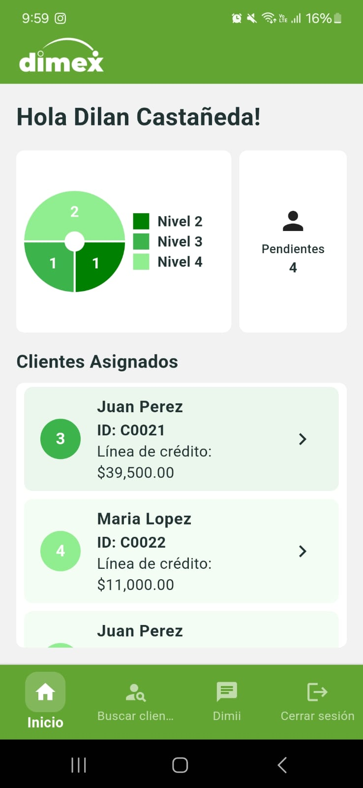
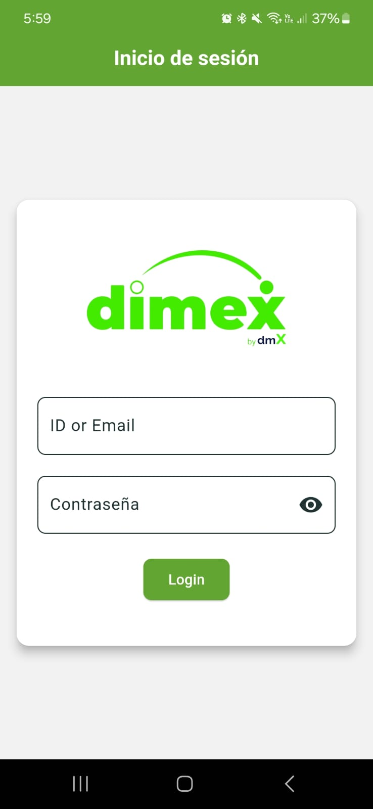
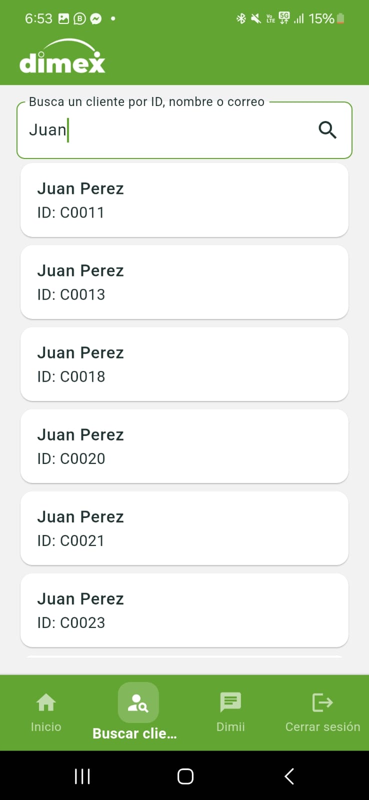
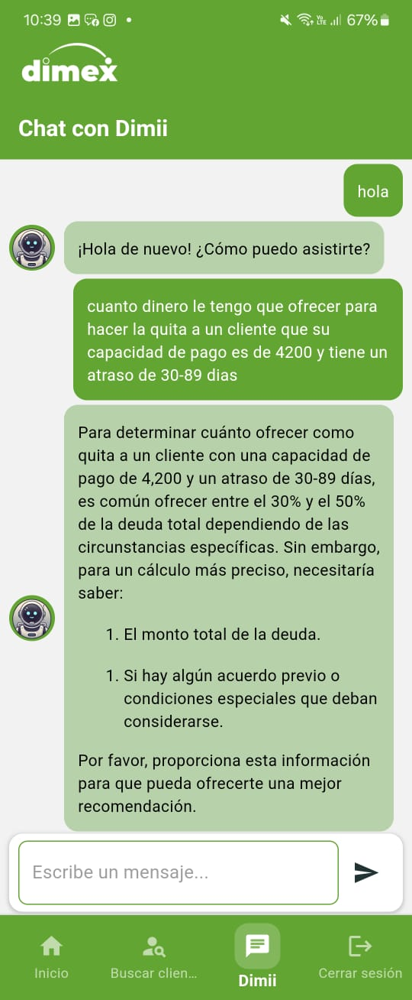
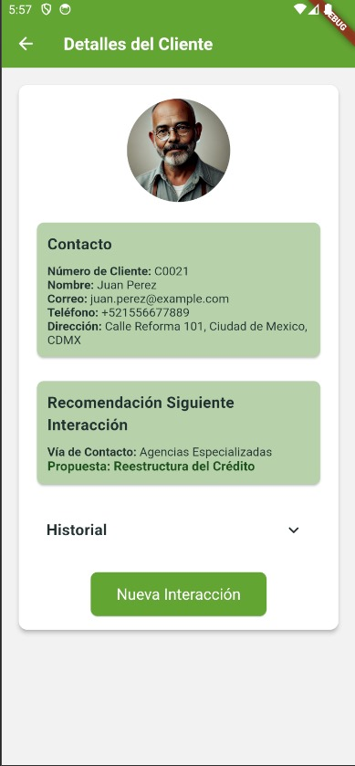
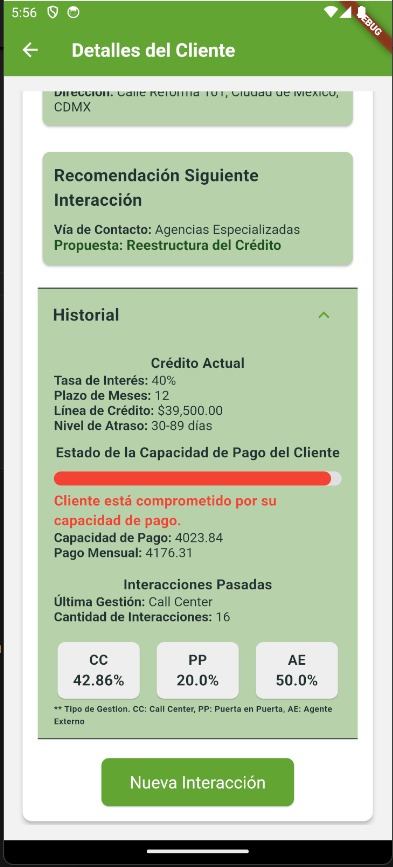
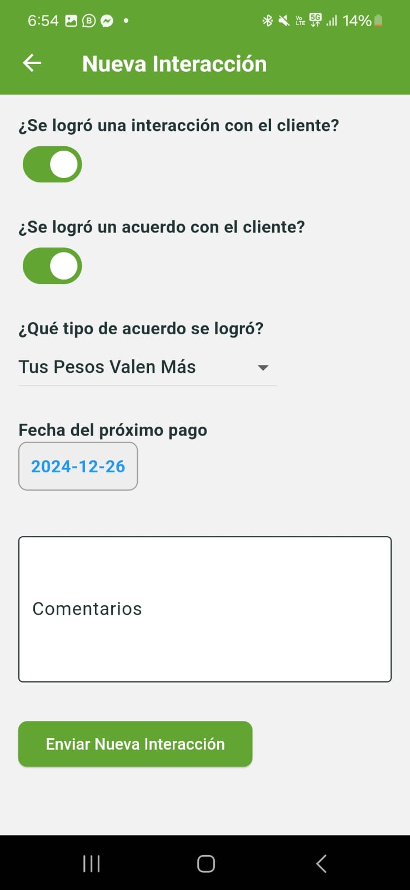

# DIMEX_REPO

This repository is a full-stack project divided into two main components:

1. **Backend**: Python-based REST API for handling Google Sheets integration, OpenAI interactions, and other backend logic.
2. **Dimex App**: A Flutter application for the frontend interface of the project.

The project leverages modern deployment techniques using **Docker containers** and **Microsoft Azure** for hosting the API and the app online.

---

## Project Structure

```
DIMEX_REPO/
│
├── .venv/               # Virtual environment for Python dependencies (excluded in .gitignore)
│
│── .gitignore           # Ignore patterns for the whole project
│
├── backend/             # Python backend for API
│   ├── db/              # Database-related files (including Google Sheets credentials)
│   ├── endpoints/       # API endpoints logic
│   ├── send_msm/        # Messaging functionality
│   ├── tests/           # Unit tests
│   ├── config.py        # Application configuration
│   ├── main.py          # Entry point of the API
│   ├── requirements.txt # Python dependencies
│   ├── Dockerfile       # Dockerfile for backend
│   └── .env             # Environment variables (e.g., OpenAI API secret key)
│
└── dimex_app/           # Flutter frontend application
    ├── android/         # Android-specific Flutter files
    ├── assets/          # Static assets like images, fonts, etc.
    ├── build/           # Build output (ignored in .gitignore)
    ├── ios/             # iOS-specific Flutter files
    ├── lib/             # Main Flutter codebase
    │   ├── main.dart    # Entry point of the Flutter app
    │   ├── screens/     # UI screens for the application
    │   ├── widgets/     # Reusable widgets/components
    │   ├── models/      # Data models for the app
    │   ├── providers/   # State management logic
    │   └── utils/       # Utility/helper functions
    ├── linux/           # Linux-specific Flutter files
    ├── macos/           # macOS-specific Flutter files
    ├── test/            # Unit and widget tests for Flutter
    ├── web/             # Web-specific Flutter files
    ├── windows/         # Windows-specific Flutter files
    ├── analysis_options.yaml # Dart analysis settings
    ├── pubspec.yaml     # Flutter dependencies and metadata
    ├── pubspec.lock     # Locked dependency versions
    ├── Dockerfile       # Dockerfile for building the Flutter app
    ├── .metadata        # Project metadata
    └── .gitignore       # Ignore patterns for the Flutter project
```

---

## Requirements

### General Tools
- **Git**: Version control system
- **Docker**: Containerization platform
- **Microsoft Azure**: For deploying the app and API online

### Backend
- **Python 3.9+**
- **Google Sheets API**:
  - Requires `credentials.json` and `token.json` in `backend/db/`
  - Follow instructions here to set up: [Google Sheets API Quickstart](https://developers.google.com/sheets/api/quickstart/python)
- **OpenAI API**:
  - Requires a `.env` file in the `backend/` directory with your OpenAI secret key.
  - Learn more about creating an assistant with document retrieval: [OpenAI API Documentation](https://platform.openai.com/docs/)

### Frontend
- **Flutter SDK 3.0+**

---

## Setup Instructions

### 1. Clone the Repository

```bash
git clone https://github.com/yourusername/DIMEX_REPO.git
cd DIMEX_REPO
```

### 2. Backend Setup

1. Navigate to the `backend/` directory:

   ```bash
   cd backend
   ```

2. Create a Python virtual environment and activate it:

   ```bash
   python -m venv .venv
   source .venv/bin/activate  # On Windows, use .venv\Scripts\activate
   ```

3. Install dependencies:

   ```bash
   pip install -r requirements.txt
   ```

4. Add the required files:
   - Place `credentials.json` and `token.json` in the `db/` directory. Follow the [Google Sheets API Quickstart](https://developers.google.com/sheets/api/quickstart/python) for details.
   - Create a `.env` file with your OpenAI API key:

     ```
     OPENAI_API_KEY=your_openai_api_key
     ```

5. Test the backend:

   ```bash
   python main.py
   ```

### 3. Frontend Setup

1. Navigate to the `dimex_app/` directory:

   ```bash
   cd dimex_app
   ```

2. Clean the Flutter Project:
   ```bash
   flutter clean
   ```

3. Regenerate the Windows Build Files
   ```bash
   flutter create .
   ```

4. Install Flutter dependencies:

   ```bash
   flutter pub get
   ```

5. Run the app locally:

   ```bash
   flutter run
   ```

### 4. Docker Setup

1. Build Docker images for both the backend and frontend:

   - **Backend**:
     ```bash
     cd backend
     docker build -t dimex-backend .
     ```
   - **Frontend**:
     ```bash
     cd dimex_app
     docker build -t dimex-app .
     ```

2. Push the images to Docker Hub (replace `username` with your Docker Hub username):

   ```bash
   docker tag dimex-backend username/dimex-backend
   docker push username/dimex-backend
   docker tag dimex-app username/dimex-app
   docker push username/dimex-app
   ```

### 5. Deploy to Microsoft Azure

1. Create an Azure account and set up a container registry.
2. Deploy the Docker images from Docker Hub to Azure Container Instances or Azure Kubernetes Service.
3. Configure DNS or endpoints to make the app and API publicly accessible.

---

### 5.1 Deploy to Android
1. After everything has been setup inside the Flutter project, run the following line:
   ```bash
     flutter build apk
     ```

## Usage

1. **Backend**:
   - The backend API provides endpoints to interact with Google Sheets and OpenAI.
   - Use tools like Postman to test API endpoints.

2. **Frontend**:
   - The Flutter app connects to the backend and provides the user interface.

---

## App Screenshots

Here are some screenshots of the Dimex App:

### Home Screen


### Login Screen


### Search a client


### Dimii: Chatbot


### Client details



### New Interaction



---

## Future Improvements

- Add CI/CD pipelines for automated builds and deployments.
- Implement user authentication for the frontend and backend.
- Optimize the app for performance and scalability.

---

Feel free to contribute or raise issues on GitHub!

## Developed by

This project was developed by:

- Ana Lucía Terán Chau - A01284622
- Diego Adrián Govea Loera - A01284894
- Dilan González Castañeda - A00831905
- Eduardo Daniel Lozano García - A00833886


**University:** Tecnológico de Monterrey   
**Course:** Analítica de datos y herramientas de inteligencia artificial  
**Group:** 103  
**Professor:** Enrique Ricardo García Hernández
